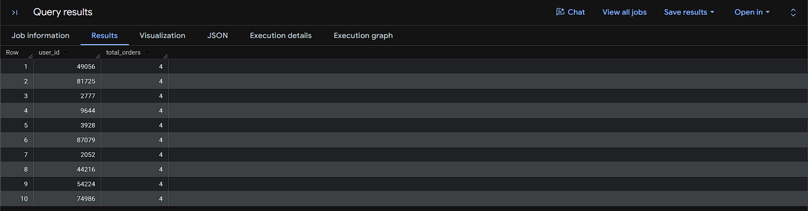
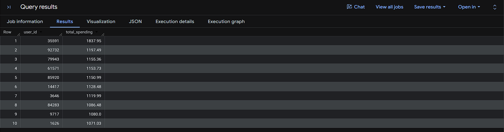
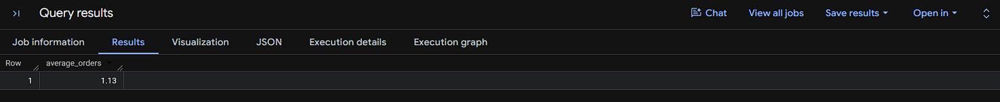
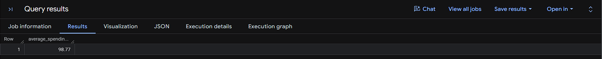
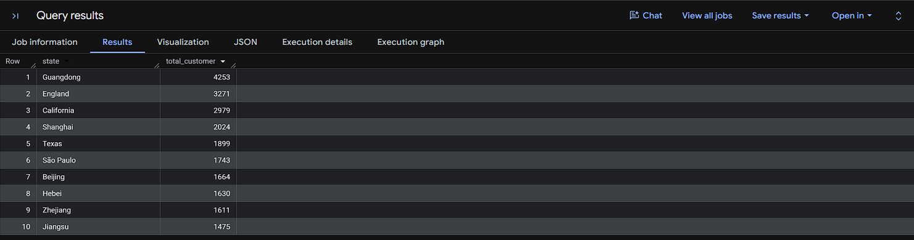
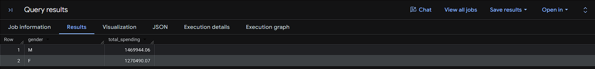
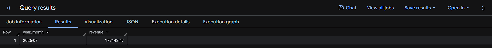

# Customer Behavior Analysis

## Project Overview

This project analyzes customer purchasing behavior using the TheLook Ecommerce dataset available in Google BigQuery Public Datasets.

The objective is to answer business-related questions regarding customer activity, spending patterns, demographics, and revenue performance using SQL.

---

## Dataset Information

**Source:** Google BigQuery Public Dataset

**Dataset Name:**

`bigquery-public-data.thelook_ecommerce`

**Tables Used:**

* users
* order_items

---

## Tools Used

* Google BigQuery
* SQL
* GitHub

---

## Business Questions

### 1. Who has the highest number of completed orders?

Identify customers with the highest purchase frequency.

### 2. Who spends the most?

Calculate total spending by customer.

### 3. What is the average number of orders per customer?

Measure overall customer purchasing activity.

### 4. What is the average spending per customer?

Calculate the average amount spent by each customer.

### 5. Which states have the most active customers?

Identify states with the highest number of customers who have completed at least one order.

### 6. Is there a difference in spending between male and female customers?

Compare total spending by gender.

### 7. Which month generated the highest revenue?

Analyze revenue performance and identify the top-performing month.

---

## Query Results

### 1. Top Customers by Orders



---

### 2. Top Customers by Spending



---

### 3. Average Orders per Customer



---

### 4. Average Spending per Customer



---

### 5. Top 10 States by Active Customers



---

### 6. Total Spending by Gender



---

### 7. Highest Revenue Month



---

## SQL Skills Demonstrated

* COUNT()
* SUM()
* AVG()
* DISTINCT
* GROUP BY
* ORDER BY
* JOIN
* Common Table Expressions (CTE)
* FORMAT_TIMESTAMP()
* Business-Oriented Analysis

---

## Key Findings

* Identified customers with the highest number of completed orders.
* Identified top-spending customers.
* Calculated average orders per customer.
* Calculated average spending per customer.
* Identified states with the highest number of active customers.
* Compared spending between male and female customers.
* Identified the month with the highest revenue generation.

---

## Project Structure

```text
customer-behavior-analysis/
│
├── README.md
├── queries.sql
└── screenshots/
    ├── 01_top_customers_by_orders.png
    ├── 02_top_customers_by_spending.png
    ├── 03_average_orders_per_customer.png
    ├── 04_average_spending_per_customer.png
    ├── 05_top_10_states_by_active_customers.png
    ├── 06_total_spending_by_gender.png
    └── 07_highest_revenue_month.png
```

---

## Author

Hengky

Data Analytics Portfolio Project
